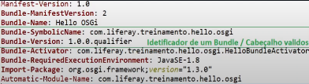
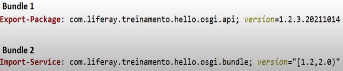
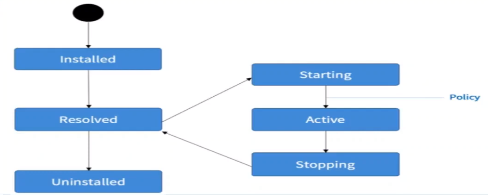

# OSGI

## OSGI - Open Service Gateway initiative

OSGI é uma especificação que define um sistema dinâmico (Que se modifica continuamente, que evolui) de componentes na plataforma. Uma especificação é, alegoricamente, um documento que define ou descreve requisitos para a construção de alguma coisa: um produto, serviço, projeto, etc. Então, as normas/requisitos/processos que devem ser seguidos na construção de determinada coisa, se chama especificação.

O objetivo do OSGI é reduzir a complexidade de software fornecendo uma arquitetura modular e orientando a serviço para sistemas distribuídos e pequenos aplicativos.

À medida que um código ou programa cresce, é natural que ele vá se tornando cada vez mais complexo. E a melhor maneira de lidar com coisas complexas é simplificar. Então dividir partes de um programa para ficar menor e mais fácil de entender é o objetivo. E essas partes podem se comunicar entre elas, são interligadas. Isso é chamado de módulo(quando o programa/projeto complexo é dividido em pequenas partes) no java. E aí entra o conceito de arquitetura modular.

A arquitetura orientada a serviços é a reutilização de componentes ou serviços aplicando interfaces. É quando conseguimos usar um mesmo serviço/componente várias vezes. Isso é bom em aplicações distribuídas ou pequenas aplicações. Então isso significa que se pode ter um projeto pequeno que pode se tornar cada vez maior utilizando a especificação OSGI.

Então, usando uma alegoria, uma implementação é como se fosse uma planta que precisa ser implementada. A aplicação desse projeto é chamada de implementação.

## Bundle

É a unidade básica de modularidade para aplicações ou os blocos que formam uma aplicação. Para facilitar a compreensão, é preciso lembrar que o OSGI usa a arquitetura modular, e neste caso, podemos ter  diferentes módulos dentro de um projeto (ex: Modulo A, Modulo B e Módulo C; pois estamos trabalhando com modularidade).

Esses módulos podem ser chamados como bundles, mas para isso eles precisam ter um identificador único e precisam ser empacotados em formato JAR. Esse identificador é registrado no ficheiro chamado manifesto e devem ter os cabeçalhos específicos:

O que vai fazer o bundle se tornar válido é o identificador único (ficheiro manifesto). Ele precisa ser empacotado, pois depois ele vai ser deployado ou adicionado no contêiner do OSGI. Esse container é responsável por gerenciar os bundles. Dentro dos contêineres pode-se ter diversos bundles e cada bundle deve ter um único identificador. É possível ter bundles com o mesmo SymbolicName, mas as versões devem ser diferentes. O contêiner do OSGI sempre vai enxergar os bundles como únicos, com um único identificador, apesar de terem vários.

Sintetizando, o bundle deve ter um identificador único (ficheiro manifesto) com cabeçalhos específicos (válidos) e empacotado como ficheiro JAR.

**No ficheiro manifesto vamos ter dois cabeçalhos específicos que nos ajudam indentificar o bundle:**

- `Bundle-SymbolicName`
- `Bundle-Version`

Várias versões de biblioteca podem coexistir. Então é possível ter Bundles com o mesmo Bundle-SymbolicName mas com versões diferentes. Dentro do contêiner OSGI eles são únicos.

**Um Bundle pode ter:**

- `Classes Java`
- `Um ficheiro Manifest`
- `Recursos: JPS, ficheiro properties, Binários ou textos`

### Versionamento semantico

**<https://semver.org/>**

## Intervalo de versão

É possível definir ou importar um bundle informando a versão que será consumida. Na liferay, é preciso informar a versão que desejo consumir.

Os colchetes indicam inclusividade, enquanto os parênteses indicam exclusividade.

Ex: [1.1,2.0) - inclui a versão 1.1 até a versão 2.0, mas exclui a versão 2.0 (Pois aí já seria uma quebra de API).

## Gerenciar o ciclo de vida de um bundle

Para isso, podemos usar linhas de comandos ou ferramentas web. Temos o Gogo Shell, que é um recurso que permite acessar o container OSGI usando o telnet.

**Um bundle tem 6 estados:**

